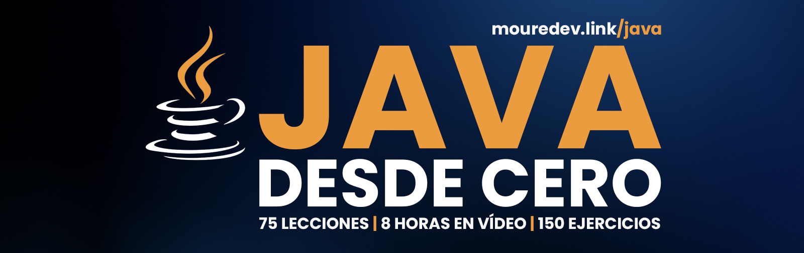

# Hello Java

## Curso para aprender el lenguaje de programación Java y Programación Orientada a Objetos (POO) desde cero y para principiantes

### Proyecto realizado durante emisiones en directo desde [Twitch](https://twitch.tv/mouredev)
> ##### Si consideras útil el curso, apóyalo haciendo "★ Star" en el repositorio. ¡Gracias!

## Clases en vídeo

### Curso de fundamentos desde cero

* [Curso de Java y POO](https://youtu.be/JOAqpdM36wI)

Introducción

* [1 - Introducción](https://youtu.be/JOAqpdM36wI?t=307)
* [2 - Contexto](https://youtu.be/JOAqpdM36wI?t=422)
* [3 - Historia](https://youtu.be/JOAqpdM36wI?t=823)
* [4 - Java Virtual Machine (JVM)](https://youtu.be/JOAqpdM36wI?t=1139)
* [5 - Características del lenguaje](https://youtu.be/JOAqpdM36wI?t=1325)
* [6 - Usos del lenguaje](https://youtu.be/JOAqpdM36wI?t=1621)
* [7 - Versiones de Java](https://youtu.be/JOAqpdM36wI?t=1963)
* [8 - Instalación](https://youtu.be/JOAqpdM36wI?t=2562)
* [9 - Editores de código](https://youtu.be/JOAqpdM36wI?t=3062)
* [10 - IDE IntelliJ Idea](https://youtu.be/JOAqpdM36wI?t=3580)
* [11 - Documentación oficial](https://youtu.be/JOAqpdM36wI?t=3892)

Primeros pasos

* [12 - Hola Mundo](https://youtu.be/JOAqpdM36wI?t=4250) | [Código](./basic/c00_helloworld/HelloWorld.java)
* [13 - Comentarios](https://youtu.be/JOAqpdM36wI?t=4937)
* [14 - Ejercicios: Primeros pasos](https://youtu.be/JOAqpdM36wI?t=5108) | [Ejercicios](./basic/c00_helloworld/HelloWorldExercises.java)
* [15 - Variables y constantes](https://youtu.be/JOAqpdM36wI?t=5294) | [Código](./basic/c01_beginner/VariablesAndConstants.java) 
* [16 - Tipos de datos primitivos](https://youtu.be/JOAqpdM36wI?t=6211) | [Código](./basic/c01_beginner/DataTypes.java)
* [17 - Ejercicios: Variables y constantes](https://youtu.be/JOAqpdM36wI?t=6732) | [Ejercicios](./basic/c01_beginner/BeginnerExercises.java)

Operadores | [Código](./basic/c02_operators/Operators.java)

* [18 - Operadores aritméticos](https://youtu.be/JOAqpdM36wI?t=6803)
* [19 - Operadores de asignación](https://youtu.be/JOAqpdM36wI?t=7069)
* [20 - Operadores de comparación](https://youtu.be/JOAqpdM36wI?t=7328)
* [21 - Operadores lógicos](https://youtu.be/JOAqpdM36wI?t=7517)
* [22 - Operadores unarios](https://youtu.be/JOAqpdM36wI?t=7863)
* [23 - Ejercicios: Operadores](https://youtu.be/JOAqpdM36wI?t=8085) | [Ejercicios](./basic/c02_operators/OperatorsExercises.java)

Strings | [Código](./basic/c03_strings/Strings.java)

* [24 - Strings](https://youtu.be/JOAqpdM36wI?t=8140)
* [25 - Concatenación](https://youtu.be/JOAqpdM36wI?t=8367)
* [26 - length](https://youtu.be/JOAqpdM36wI?t=8469)
* [27 - charAt](https://youtu.be/JOAqpdM36wI?t=8535)
* [28 - substring](https://youtu.be/JOAqpdM36wI?t=8707)
* [29 - toUpperCase / toLowerCase](https://youtu.be/JOAqpdM36wI?t=8831)
* [30 - contains](https://youtu.be/JOAqpdM36wI?t=8947)
* [31 - equals](https://youtu.be/JOAqpdM36wI?t=9118)
* [32 - trim y replace](https://youtu.be/JOAqpdM36wI?t=9456)
* [33 - format](https://youtu.be/JOAqpdM36wI?t=9613)
* [34 - Ejercicios: Strings](https://youtu.be/JOAqpdM36wI?t=9838) | [Ejercicios](./basic/c03_strings/StringsExercises.java)

Condicionales | [Código](./basic/c04_conditionals/Conditionals.java) | [Ejercicios](./basic/c04_conditionals/ConditionalsExercises.java)

* [35 - Condicionales](https://youtu.be/JOAqpdM36wI?t=9908)
* [36 - Sentencia if](https://youtu.be/JOAqpdM36wI?t=9978)
* [37 - Sentencia switch](https://youtu.be/JOAqpdM36wI?t=10678)
* [38 - Ejercicios: Condicionales](https://youtu.be/JOAqpdM36wI?t=11021)

Estructuras

* [39 - Estructuras de datos](https://youtu.be/JOAqpdM36wI?t=11115)
* [40 - Arrays](https://youtu.be/JOAqpdM36wI?t=11194) | [Código](./basic/c05_structures/Arrays.java)
* [41 - Listas](https://youtu.be/JOAqpdM36wI?t=12233) | [Código](./basic/c05_structures/Lists.java)
* [42 - Sets](https://youtu.be/JOAqpdM36wI?t=13502) | [Código](./basic/c05_structures/Sets.java)
* [43 - Maps](https://youtu.be/JOAqpdM36wI?t=14574) [Código](./basic/c05_structures/Maps.java)
* [44 - Ejercicios: Estructuras](https://youtu.be/JOAqpdM36wI?t=15680) | [Ejercicios](./basic/c05_structures/StructuresExercises.java)

Bucles | [Código](./basic/c06_loops/Loops.java)

* [45 - Bucles](https://youtu.be/JOAqpdM36wI?t=15862)
* [46 - for](https://youtu.be/JOAqpdM36wI?t=16003)
* [47 - forEach](https://youtu.be/JOAqpdM36wI?t=16646)
* [48 - while / do while](https://youtu.be/JOAqpdM36wI?t=17199)
* [49 - Control de bucles](https://youtu.be/JOAqpdM36wI?t=17688)
* [50 - Ejercicios: Bucles](https://youtu.be/JOAqpdM36wI?t=17993) | [Ejercicios](./basic/c06_loops/LoopsExercises.java)

Funciones | [Código](./basic/c07_functions/Functions.java)

* [51 - Funciones](https://youtu.be/JOAqpdM36wI?t=186100)
* [52 - Funciones sin parámetros ni retorno](https://youtu.be/JOAqpdM36wI?t=18394)
* [53 - Funciones con parámetros / Sobrecarga](https://youtu.be/JOAqpdM36wI?t=18827)
* [54 - Funciones con retorno](https://youtu.be/JOAqpdM36wI?t=19027)
* [55 - Ejercicios: Funciones](https://youtu.be/JOAqpdM36wI?t=19521) | [Ejercicios](./basic/c07_functions/FunctionsExercises.java)

Programación Orientada a Objetos (POO)

* [56 - Programación Orientada a Objetos (POO)](https://youtu.be/JOAqpdM36wI?t=19586)
* [57 - Clases y objetos](https://youtu.be/JOAqpdM36wI?t=19902) | [Código](./basic/c08_oop/Classes.java) | [Clase Persona](./basic/c08_oop/Person.java)
* [58 - Ejercicios: Clases y objetos](https://youtu.be/JOAqpdM36wI?t=21434) | [Ejercicios](./basic/c08_oop/ClassesExercises.java)
* [59 - Modificadores de acceso](https://youtu.be/JOAqpdM36wI?t=21542) | [Código](./basic/c08_oop/AccessModifiers.java) | [Clases (otro paquete para pruebas)](./basic/c08_test_oop/Classes.java)
* [60 - Ejercicios: Modificadores de acceso](https://youtu.be/JOAqpdM36wI?t=23202) | [Ejercicios](./basic/c08_oop/AccessModifiersExercises.java)
* [61 - Herencia](https://youtu.be/JOAqpdM36wI?t=23334) | [Código](./basic/c08_oop/Inheritance.java)
* [62 - Ejercicios: Herencia](https://youtu.be/JOAqpdM36wI?t=24373) | [Ejercicios](./basic/c08_oop/InheritanceExercises.java)
* [63 - Polimorfismo](https://youtu.be/JOAqpdM36wI?t=24505) | [Código](./basic/c08_oop/Polymorphism.java)
* [64 - Ejercicios: Polimorfismo](https://youtu.be/JOAqpdM36wI?t=25474) | [Ejercicios](./basic/c08_oop/PolymorphismExercises.java)
* [65 - Abstracción](https://youtu.be/JOAqpdM36wI?t=25550) | [Código](./basic/c08_oop/Abstraction.java)
* [66 - Ejercicios: Abstracción](https://youtu.be/JOAqpdM36wI?t=26892) | [Ejercicios](./basic/c08_oop/AbstractionExercises.java)
* [67 - Composición](https://youtu.be/JOAqpdM36wI?t=26963) | [Código](./basic/c08_oop/Composition.java)

Excepciones

* [68 - Excepciones](https://youtu.be/JOAqpdM36wI?t=27441)
* [69 - Manejo de excepciones](https://youtu.be/JOAqpdM36wI?t=27930) | [Código](./basic/c09_exceptions/Exceptions.java) 
* [70 - Lanzamiento de excepciones](https://youtu.be/JOAqpdM36wI?t=28611) | [Código](./basic/c09_exceptions/ThrowExample.java)
* [71 - Excepciones personalizadas](https://youtu.be/JOAqpdM36wI?t=29181) | [Código](./basic/c09_exceptions/CustomException.java)
* [72 - Ejercicios: Excepciones](https://youtu.be/JOAqpdM36wI?t=29721) | [Ejercicios](./basic/c09_exceptions/ExceptionsExercises.java)

Depuración de errores |

* [73 - Depuración de errores](https://youtu.be/JOAqpdM36wI?t=29772)

Extras |

* [74 - Extras](https://youtu.be/JOAqpdM36wI?t=30409) | [Código](./basic/c10_extras/Extras.java) | [Ejemplo](./basic/c10_extras/ExtrasExample.java)
* [75 - Ejercicios: Extras](https://youtu.be/JOAqpdM36wI?t=31583) | [Ejercicios](./basic/c10_extras/ExtrasExercises.java)

* [Próximos pasos](https://youtu.be/JOAqpdM36wI?t=31658)

## Enlaces de interés

* [Guía gratis de Java en PDF](https://campus.mouredev.pro/products/digital_downloads/guia-fundamentos-java)
* Impacto: [Índice TIOBE](https://www.tiobe.com/tiobe-index/) | [GitHub](https://github.blog/news-insights/octoverse/octoverse-2024/) | [Stack Overflow](https://survey.stackoverflow.co/2024/technology#most-popular-technologies-language)
* [Historia](https://es.wikipedia.org/wiki/Java_(lenguaje_de_programaci%C3%B3n)) | [Kotlin](https://kotlinlang.org/)
* [Java 8](https://www.java.com/es/download/) | [Java SE](https://www.oracle.com/es/java/technologies/java-se-glance.html) | [Java EE](https://www.oracle.com/es/java/technologies/java-ee-glance.html)
* [OpenJDK](https://openjdk.org/) | [Oracle JDK](https://www.oracle.com/es/java/technologies/downloads/)
* Editores: [IntelliJ Community](https://www.jetbrains.com/idea/download/other.html) | [VS Code](https://code.visualstudio.com/docs/languages/java) | [NetBeans](https://netbeans.apache.org/front/main/index.html) | [Eclipse](https://eclipseide.org/) | [BlueJ](https://www.bluej.org/) | [Playground web](https://dev.java/playground/)
* [Documentación oficial](https://docs.oracle.com/en/java/)
* [Guía de estilo](https://google.github.io/styleguide/javaguide.html)

## Únete al campus de programación de la comunidad

#### Te presento [mouredev pro](https://mouredev.pro), mi proyecto más importante para ayudarte a estudiar programación y desarrollo de software de manera diferente.

> **¿Buscas un extra?** Aquí encontrarás cursos editados por lecciones individuales, para avanzar a tu ritmo y guardar el progreso. También dispondrás de ejercicios y correcciones, test para validar tus conocimientos, examen y certificado público de finalización, soporte, foro de estudiantes, reunionnes grupales, cursos exclusivos y mucho más.
> 
> Entra en **[mouredev.pro](https://mouredev.pro)** y utiliza el cupón **"PRO"** con un 10% de descuento en tu primera suscripción.

## Preguntas frecuentes

#### ¿Debo tener conocimientos previos?
Mi idea es que el curso sea desde cero y para principiantes. Pensado para una persona que comienza por primera vez a programar. Es un curso de fundamentos, donde nos centraremos en aprender las bases del lenguaje con Java puro. Esto no es un curso para aprender a desarrollar proyectos. Vamos a empezar desde el principio.

Si la acogida de la comunidad es buena, seguiré creando cursos más avanzados.

#### ¿Este curso se va a subir a YouTube?

Sí, una vez finalizados, todos los cursos son editados y subidos en bloque a YouTube.

#### ¿Se creará una continuación del curso?
Si, una vez publicado en YouTube, el apoyo de la comunidad es bueno, crearé un nuevo curso con lecciones más avanzadas.

#### ¿Existe algún lugar donde consultar dudas?
He creado un canal llamado "Java" en el [servidor de Discord](https://discord.gg/mouredev) de la comunidad. Allí puedes consultar dudas y ayudar al resto de miembros. Así nos beneficiamos tod@s.

#### ¿Cómo puedo practicar?
En cada lección encontrarás ejercicios para poner en práctica lo aprendido. También puedes realizar los ejercicios de mi web [retosdeprogramacion.com](https://retosdeprogramacion.com).

##  Hola, mi nombre es Brais Moure.
### Freelance fullstack iOS & Android engineer

Soy ingeniero de software desde 2010. Desde 2018 combino mi trabajo desarrollando Apps con la creación de contenido formativo sobre programación y tecnología en diferentes redes sociales como **[@mouredev](https://moure.dev)**.

Si quieres unirte a nuestra comunidad de desarrollo, aprender programación, mejorar tus habilidades y ayudar a la continuidad del proyecto, puedes encontrarnos en:

 
 
